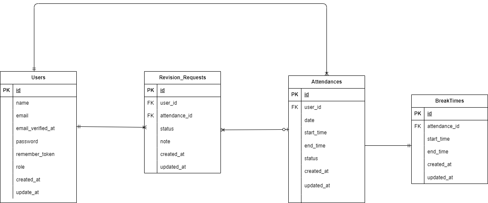

# attendance(勤怠管理アプリ)

## 概要
本プロジェクトは、ユーザーの勤怠と管理を目的とするアプリです。  
勤怠機能、勤怠管理機能、承認機能などを備えています。

# 環境構築

1. Dockerを起動する

2. プロジェクト直下で、以下のコマンドを実行する

```
make init
```

※Makefileは実行するコマンドを省略することができる便利な設定ファイルです。コマンドの入力を効率的に行えるようになります。<br>

## メール認証
mailtrapというツールを使用しています。<br>
以下のリンクから会員登録をしてください。　<br>
https://mailtrap.io/

メールボックスのIntegrationsから 「laravel 7.x and 8.x」を選択し、　<br>
.envファイルのMAIL_MAILERからMAIL_ENCRYPTIONまでの項目をコピー＆ペーストしてください。　<br>
MAIL_FROM_ADDRESSは任意のメールアドレスを入力してください。　


## ER図


## テストアカウント


## PHPUnitを利用したテストに関して
以下のコマンド:  
```
docker-compose exec php bash
php artisan migrate:fresh --env=testing
./vendor/bin/phpunit
```
  
